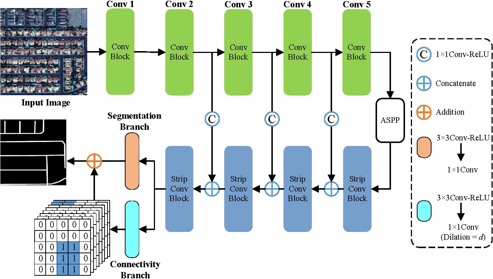

## CoANet: Connectivity Attention Network for Road Extraction From Satellite Imagery

This paper ([CoANet](https://ieeexplore.ieee.org/document/9563125)) has been published in IEEE TIP 2021.

This code is licensed for non-commerical research purpose only.

### Introduction

Extracting roads from satellite imagery is a promising approach to update the dynamic changes of road networks efficiently and timely. However, it is challenging due to the occlusions caused by other objects and the complex traffic environment, the pixel-based methods often generate fragmented roads and fail to predict topological correctness. In this paper, motivated by the road shapes and connections in the graph network, we propose a connectivity attention network (CoANet) to jointly learn the segmentation and pair-wise dependencies. Since the strip convolution is more aligned with the shape of roads, which are long-span, narrow, and distributed continuously. We develop a strip convolution module (SCM) that leverages four strip convolutions to capture long-range context information from different directions and avoid interference from irrelevant regions. Besides, considering the occlusions in road regions caused by buildings and trees, a connectivity attention module (CoA) is proposed to explore the relationship between neighboring pixels. The CoA module incorporates the graphical information and enables the connectivity of roads are better preserved. Extensive experiments on the popular benchmarks (SpaceNet and DeepGlobe datasets) demonstrate that our proposed CoANet establishes new state-of-the-art results.



### Citations

If you are using the code/model provided here in a publication, please consider citing:

    @article{mei2021coanet,
    title={CoANet: Connectivity Attention Network for Road Extraction From Satellite Imagery},
    author={Mei, Jie and Li, Rou-Jing and Gao, Wang and Cheng, Ming-Ming},
    journal={IEEE Transactions on Image Processing},
    volume={30},
    pages={8540--8552},
    year={2021},
    publisher={IEEE}
    }

### Requirements

The code is built with the following dependencies:

- Python 3.6 or higher
- CUDA 10.0 or higher
- [PyTorch](https://pytorch.org/) 1.2 or higher
- [tqdm](https://github.com/tqdm/tqdm.git)
- matplotlib
- pillow
- tensorboardX

### Data Preparation
#### PreProcess SpaceNet Dataset
- Convert SpaceNet 11-bit images to 8-bit Images.
- Create road masks (3m), country wise.
- Move all data to single folder.

*SpaceNet dataset tree structure after preprocessing.*

```
spacenet
|
└───gt
│   └───AOI_2_Vegas_img1.tif
└───images
│   └───RGB-PanSharpen_AOI_2_Vegas_img1.tif
```

*Download DeepGlobe Road dataset in the following tree structure.*
```
deepglobe
│
└───gt
│   └───388_mask.jpg
└───images
│   └───388_sat.jpg
```
#### Create Crops and connectivity cubes
```
python create_crops.py --base_dir ./data/spacenet/ --dataset SpaceNet --crop_size 650
python create_crops.py --base_dir ./data/deepglobe/train --dataset DeepGlobe --crop_size 512
```
```
python create_connection.py --base_dir ./data/spacenet/crops
python create_connection.py --base_dir ./data/deepglobe/train/crops
```
```
spacenet
|   train.txt
|   val.txt
|   train_crops.txt   # created by create_crops.py
|   val_crops.txt     # created by create_crops.py
|
└───gt
│
└───images
│
└───crops
│   └───connect_8_d1	# created by create_connection.py
│   └───connect_8_d3	# created by create_connection.py
│   └───gt		# created by create_crops.py
│   └───images	# created by create_crops.py
```


### Testing
The pretrained model of CoANet can be downloaded:
- [SpaceNet](https://drive.google.com/file/d/19JQ919DJw8CVs0xuUsLEffAugzlpbOHN/view?usp=sharing)
- [DeepGlobe](https://drive.google.com/file/d/1XR5J0voGa8ammhh2y3e0u3b-EsjbJCmE/view?usp=sharing)

Run the following scripts to evaluate the model.
- SpaceNet
```
python test.py --ckpt='./run/spacenet/CoANet-resnet/CoANet-spacenet.pth.tar' --out_path='./run/spacenet/CoANet-resnet' --dataset='spacenet' --base_size=1280 --crop_size=1280
```
- DeepGlobe
```
python test.py --ckpt='./run/DeepGlobe/CoANet-resnet/CoANet-DeepGlobe.pth.tar' --out_path='./run/DeepGlobe/CoANet-resnet' --dataset='DeepGlobe' --base_size=1024 --crop_size=1024
```

### Evaluate APLS

* Please refer to [CosmiQ-apls](https://github.com/CosmiQ/apls) to compute APLS for SpaceNet and [antran89-road_visualizer](https://github.com/antran89/road_visualizer) for DeepGlobe.


### Training
Follow steps below to train your model:

1. Configure your dataset path in [mypath.py].
2. Input arguments: (see full input arguments via python train.py --help):
```Shell
usage: train.py [-h] [--backbone resnet]
                [--out-stride OUT_STRIDE] [--dataset {spacenet,DeepGlobe}]
                [--workers N] [--base-size BASE_SIZE]
                [--crop-size CROP_SIZE] [--sync-bn SYNC_BN]
                [--freeze-bn FREEZE_BN] [--loss-type {ce,con_ce,focal}] [--epochs N]
                [--start_epoch N] [--batch-size N] [--test-batch-size N]
                [--use-balanced-weights] [--lr LR]
                [--lr-scheduler {poly,step,cos}] [--momentum M]
                [--weight-decay M] [--nesterov] [--no-cuda]
                [--gpu-ids GPU_IDS] [--seed S] [--resume RESUME]
                [--checkname CHECKNAME] [--ft] [--eval-interval EVAL_INTERVAL]
                [--no-val]

```
3. To train CoANet using SpaceNet dataset and ResNet as backbone:
```Shell
python train.py --dataset=spacenet
```

### Contact

For any questions, please contact me via e-mail: meijie@mail.nankai.edu.cn.

### Acknowledgment

This code is based on the [pytorch-deeplab-xception](https://github.com/jfzhang95/pytorch-deeplab-xception) codebase.
